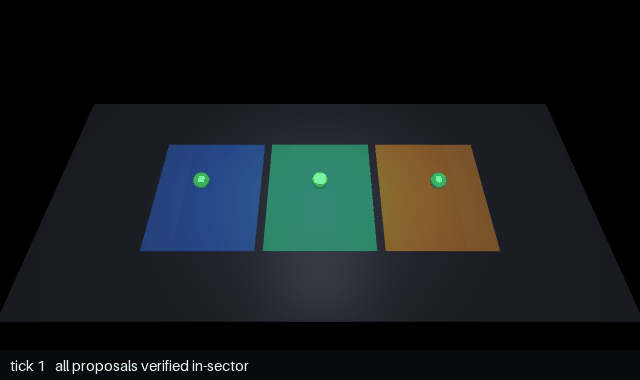
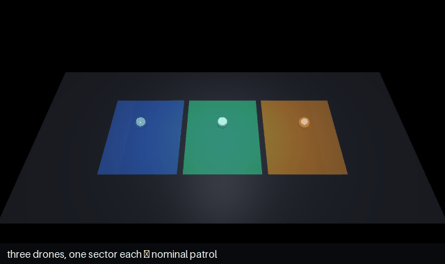

<p align="center">
  <picture>
    <source media="(prefers-color-scheme: dark)" srcset="docs/assets/logo-dark.png">
    
  </picture>
</p>

<p align="center">
  <a href="https://github.com/levitatingflyfisher/openDaisugi/actions/workflows/ci.yml"></a>
  
  
</p>

**A JIT compiler for AI agents, with a runtime-assurance guard.** Agents are billed
by the token yet re-plan the same work from scratch every time. openDaisugi compiles
that repetition: it distils your repeated successes into reusable **skills** — frozen
scripts and typed pathways that replay without re-planning, the deterministic ones for
**zero tokens** — and sizes every step that still needs a model to the cheapest one
that can run it. Underneath, a Z3-backed check proves each action stays inside a
declared safety *envelope* **before it runs** — fail-closed, usually milliseconds and
no tokens. Cheapest and safest turn out to be the same move: **separate what is
_allowed_ from what is _decided_.**

## Install

```bash
uv add opendaisugi          # or: pip install opendaisugi
```

Python 3.12+. The `z3-solver` native dependency installs automatically. Add
`opendaisugi[search]` if you want pathway reuse (it pulls in
`sentence-transformers`; without it `find_pathway()` returns `None` and every run
re-plans — no error, just no reuse).

<details>
<summary>Optional extras — reuse, MCP server, robotics, LoRA</summary>

```bash
uv add 'opendaisugi[search]'    # REQUIRED for pathway reuse (sentence-transformers, ~80 MB)
uv add 'opendaisugi[mcp]'       # MCP server for Claude Code / Codex / Hermes / OpenClaw
uv add 'opendaisugi[robotics]'  # MuJoCo executor (experimental)
uv add 'opendaisugi[lora]'      # LoRA training-data pipeline
```

Bare `uv add opendaisugi` stays lightweight (the verifier and routing work without
`[search]`); only Tier-0 reuse needs the embedding model.
</details>

## See it refuse an unsafe action

No API key, no network — pure Z3, milliseconds. The envelope says what's allowed;
the plan an LLM proposed must stay inside it, **proven before anything runs**:

```python
from opendaisugi import ActionPlan, Daisugi, Envelope, Permission, ShellStep

dai = Daisugi()

# The envelope is the contract: this agent may only run `find`.
envelope = Envelope(
    generated_by="you",
    task="clean up stale logs",
    permissions=Permission(shell=True, shell_allowlist=["find"]),
)

# An LLM proposed this plan. Prove it's in-bounds BEFORE anything runs.
plan = ActionPlan(
    source="some-llm",
    task="clean up stale logs",
    steps=[ShellStep(id="s1", command="rm -rf /var/log")],  # not `find`!
)

result = dai.verify(plan, envelope)  # pure, sync, milliseconds, zero tokens
print("allowed:", result.ok)
for v in result.violations:
    print(f"  [{v.stage}] {v.message}")
```

```
allowed: False
  [permissions] Step 's1' shell command 'rm' not in allowlist ['find']
```

That `False` is a Z3 result, not a string match — the plan asked to run `rm`, the
envelope only admits `find`, so it never executes. Swap the command for
`find /var/log -name '*.tmp' -delete` and it verifies. That's the whole idea, and
everything below is built on it.

---

## What it does

Three ways to use it, each its own section below:

- **[Gate an agent you're already running](#gate-an-agent-youre-already-running)** —
  drop a fail-closed guard in front of a live Claude Code / Codex / Hermes /
  OpenClaw session; shadow-mode first, one flag to enforce.
- **[Run a whole prompt end to end](#run-a-whole-prompt-end-to-end--the-orchestrator)** —
  one prompt → a verified, typed-step plan → each reasoning step routed to the
  cheapest capable model → synthesized answer.
- **[Compile the work you repeat](#compile-the-work-you-repeat)** — distil repeated
  successes into pathways that skip planning and, when deterministic, run for zero
  tokens.

All three sit *on top of* the same guarantee: every plan and every step is
re-verified against its envelope before it runs — so routing and reuse make agents
cheaper without ever making them less safe.

---

## Gate an agent you're already running

The fail-closed guard from the hello-world, in front of a live session: every tool
call is proven inside an envelope *before it runs*, shadow-mode first, one flag to
enforce.

```bash
daisugi gate quickstart      # → a working shadow-mode gate in minutes
```

It is not a demo. A real delegated sub-agent asked to read a file outside its
envelope is denied by the gate, the value withheld from the model, the reason
proof-backed — captured verbatim in
[`examples/injection-denied/`](examples/injection-denied/):

```
DENIED Read '/.../infra/deploy_region.txt'
  reason: permissions: file_read path '/.../infra/deploy_region.txt'
          not permitted by file_read ['/.../workspace/**']
```

The same 13-attack corpus that gates this project's own merges is one command:
`daisugi gate audit` (denial 1.00; false-positive rate published, not hidden).
Start here: **[Protect an agent you're already running](docs/tutorials/protect-your-existing-session.md)**.

---

## Run a whole prompt end to end — the Orchestrator

One prompt becomes a verified, typed-step plan; each reasoning step runs on a
model sized to its difficulty under a token budget; the results are synthesized
into an answer. A prompt that matches a distilled pathway skips planning and
reuses the stored plan.

```python
from opendaisugi import Daisugi

dai = Daisugi()
result = await dai.orchestrate(
    "summarize the open PRs and draft a standup note",
    budget_tokens=20_000,          # gates routing DURING the run, not after
)
print(result.final_answer)
for s in result.sizings:           # per-step: difficulty → the model it ran on
    print(s.step_id, s.difficulty, s.tier, s.model)
print(result.budget.spent, "tokens")
```

Or from the CLI: `daisugi orchestrate "…" --budget 20000`.

**What routing actually does** (it is not a static up-front pick):

- **Capability sizing.** Each reasoning step is sized to the cheapest model that
  can handle its difficulty — a quick classification doesn't get the frontier
  model. Steps that touch the shell, filesystem, or network run directly, with
  no model to size.
- **Live budget gating.** As the run spends, each remaining step is re-sized
  against what is *left*; when the budget is tight the model is downgraded, and
  in strict mode a step whose cheapest rung is still unaffordable fails
  **without an LLM call** rather than overspending.
- **Tier-0 reuse.** If a distilled pathway already covers the prompt, the plan
  is reused and re-verified against *your* envelope — skipping the decompose
  call entirely.

The decomposed plan is verified against a safety envelope before it runs, and
each step is re-verified at execution time — routing and assembly sit *on top
of* the assurance guarantees, never weakening them. The pieces are composable:
`decompose()`, `size_plan()`, `BudgetTracker`, `synthesize()`.

---

## Compile the work you repeat


`daisugi tend` is a batch pass over your journal. When a task has succeeded a few
times (three, by default), it distills those runs into a pathway — the plan and
the envelope it ran inside. Later, when a prompt is close enough to a stored
pathway (cosine similarity ≥ 0.55), the orchestrator reuses that plan instead of
calling a model to derive a new one. Two consequences:

- **The planning call doesn't happen.** Reuse serves the stored plan directly.
- **Deterministic steps run without a model.** A plan is a graph of typed steps.
  `shell`, `file_read`, `file_write`, and `network` steps run via subprocess and
  urllib — no inference. A pathway made only of those does its work for zero
  tokens; the one model call left is the final assembly of the answer, and
  `--deterministic-synthesis` turns that off too, for a run that spends nothing.
  Other step types do use a model: `task` and `agentic` reason, `skill` and
  `mcp` are whatever their handler is, `vla` runs a policy.

The whole idea is one table — *the right tool for the job*, where the cheapest
tool is usually the safest one too:

| The job | Right tool | Token cost | Why it's *also* the safe choice |
|---|---|---|---|
| A fixed command you run constantly | **frozen script** | 0 | nothing to inject — no model in it to fool; runs verbatim inside its envelope |
| Same shape, varying inputs (*read `report-{date}.md`*) | **typed skill** | ~0 (bind) | the input is *data* whose location is pinned (a file's directory, a URL's host), re-checked against the envelope before it runs |
| Genuine reasoning | **LLM fit to purpose** | a right-sized model | the smallest capable model is cheaper *and* has less attack surface |
| Never seen before | **fresh decompose** | full plan | planned under an envelope, verified before a single action runs |

Run it yourself, offline, with no API key —
[`examples/reuse-receipt/`](examples/reuse-receipt/) seeds a distilled `grep`
pathway, reuses it, and prints:

```
prompt reused a distilled pathway : True
plan step types                   : ['shell']
synthesis used an LLM             : False
tokens spent (whole run)          : 0
```

**Two reuse paths — don't confuse them.** The orchestrator's **Tier-0 reuse**
serves a matched pathway's plan *verbatim* and re-verifies it against your
envelope — no planning call, deterministic steps for zero tokens (the receipt
above). Separately, `dai.adapt_plan(match, task=…)` is an *optional* helper for
when you want to reshape a template to a near-neighbour task: it spends one cheap
Tier-1 call, then re-verifies (falling back to the untouched template if the
adaptation fails to verify). It is **not** what `orchestrate()` calls — reuse is
verbatim by default. So "reuse" means "serve the proven plan again," not "adapt it
to a novel prompt"; the 0.55 threshold is what keeps those the same thing.

<details>
<summary>The honest edges of reuse (cold start, cost, what's proven)</summary>

| | |
|---|---|
| **Cold start** | Pathways require ≥ 3 successful traces of a similar task before `tend()` produces one. The first few runs of any new task type pay full cost. |
| **`tend()` is not free** | It costs one LLM call per cluster. Use `tend_after` conservatively or run it offline (`daisugi tend`). |
| **Verbatim ≠ adapt** | Tier-0 reuse is ~free but only fires on a close match. `adapt_plan` reshapes a template with a cheap Tier-1 call — not zero tokens. |
| **Reuse is re-verified** | Every reused or adapted plan is re-verified against the stored envelope before it runs. A pathway that drifts out of policy fails verification and falls back to the cold path automatically. |
| **Does it pay?** | Real in direction, not yet proven at scale — measure it on *your* corpus with `examples/jit-metrics/`, and watch [Stage 4](docs/roadmap.md). |
</details>

### The tool that's cheapest is usually the one that's safest

Most systems trade cost against safety. openDaisugi's structure collapses the
trade, because both come from the same move — *not putting a general intelligence
where a specific tool belongs.* A distilled `grep` script costs **zero tokens**
*and* **cannot be prompt-injected**: there is no model in it to fool. Sizing a
step to the smallest capable model is cheaper *and* narrows its attack surface.
Saving tokens and staying safe stop being two goals; they are one.

Underneath sits the line the whole system is built on — *separate what is
**allowed** from what is **decided:***


The LLM **decides** — it crosses the *intent gap* no other tool can, turning
fuzzy intent into a concrete plan. The envelope says what is **allowed**. Where a
bound is *symbolic*, Z3 **proves** it — a guarantee, for milliseconds and no
tokens. Where a bound is *perceptual* ("is the doorway clear?", "is this reply
kind?"), only an LLM or VLM can **judge** it — that is the *perception gap*, and
openDaisugi is honest that a judgment is bounded, not proven. Guarantee what you
can, judge-and-bound what you can't, and never let the second pretend to be the
first.

---

## Measured, not claimed

Two claims the "JIT compiler for agent inference" framing makes checkable, run
over a real journal corpus (reproduce: `python examples/jit-metrics/measure_corpus.py`):

| Question | Measured answer |
|---|---|
| **Is the safety guard cheap?** | Z3 `verify` runs in a **sub-4 ms** median with a **0% timeout rate** over the corpus. |
| **Does the guard need an LLM?** | For every envelope in this corpus the guard is **purely symbolic — zero tokens**.¹ |
| **How much of the corpus is compilable into reusable pathways?** | **≈46% of all interactions** — an explicit **upper bound**.² |

¹ *100% here because this corpus's envelopes carry no perceptual (`llm_check`)
predicates. Envelopes that do carry one pay an LLM at Stage-2 discharge — the
ruler reports that fraction honestly for whatever corpus you point it at.*

² *"Compilable" = the interaction lands in a cluster of ≥3 similar successes
(the distiller's own precondition) **and** its plan still verifies. It proves an
interaction is authorized and structurally distillable — **not** that a reused
plan would be correct. There is no correctness oracle; the number is a ceiling,
and the corpus is benchmark-generated, so treat it as "what the ruler finds
here," then point it at your own journal.*

The guard cost is the honest, proven "easy win": a fail-closed proof that every
action is in-bounds, for milliseconds and no tokens, orders of magnitude below
the LLM call that authored the plan. That is [runtime
assurance](https://en.wikipedia.org/wiki/Runtime_assurance)'s founding
assumption — *checking must be far cheaper than doing* — satisfied and measured,
not asserted. The ruler and its full output live in
[`examples/jit-metrics/`](examples/jit-metrics/).

**On token savings, honestly.** The provable, demonstrated win is narrow and
real: a reused deterministic pathway spends zero tokens — the receipt above shows
it with no API key. Routing is a difficulty heuristic, not a proof; it is usually
cheaper, but a downgraded step that fails can recompute, so read it as an
expectation, not a guarantee. The *average* saving across a mixed workload
depends on how much of your work recurs and how much is deterministic rather than
genuine reasoning — so this repo ships a **ruler to measure your savings on your
corpus** rather than a billboard number. Settling the reuse question at scale is
roadmap [Stage 4](docs/roadmap.md#stage-4--the-distillation-fidelity-problem).

---

## See it: runtime assurance for a robot swarm

The guard is domain-agnostic — the same `verify()` that gates a shell command
gates a robot's next move. Pointed at a foundation-model swarm it looks like
this:



Three drones patrol a property, one sector each. A black-box policy (a stand-in for a
VLA like π0 / SmolVLA) proposes each drone's next move; openDaisugi verifies it live
against the drone's sector envelope + swarm deconfliction — **green** accepted,
**amber** an out-of-sector proposal refused and pulled back (Simplex fallback),
**red** a proposal held because it closed on a peer. No drone can leave its sector and
no two can collide, *proven every tick before motion*, whatever the policy proposes.
Runnable: [`examples/property-patrol/`](examples/property-patrol/) (the gate, CPU,
zero deps) + `mujoco_render.py` (this recording).

And delegation — *a message that carries authority is a delegation*, verified before anyone acts:



`drone_mid` loses comms; the coordinator expands `drone_west`'s authority to cover the
gap — **accepted** only after `verify_swarm_tasking` re-proves it's still contained
*and* deconflicted; the "hand it to both neighbors" alternative flashes the overlap
**red — rejected before any drone moves**. Four such scenarios (hierarchy · hand-off ·
comms-loss · cross-swarm) in [`examples/swarm-comms-delegation/`](examples/swarm-comms-delegation/),
and sixteen kinds of refusal at once in [`examples/gallery/`](examples/gallery/) — each
tile a *real* `verify()` rejection, asserted before a single frame renders.

---

## Wire it into your agent

One command detects every agent harness on your machine and wires openDaisugi in
from a single source of truth:

```bash
daisugi install             # detect + configure every harness
daisugi install --dry-run   # preview every change, write nothing
daisugi install --uninstall # reverse every managed change
```

It installs three idempotent, backed-up, reversible layers per harness:

| Layer | What | Claude Code | Codex | Hermes | OpenClaw |
|-------|------|-------------|-------|--------|----------|
| **Skill** | `opendaisugi-checklist` (on-demand, 0 token tax) | `~/.agents/skills` → `~/.claude/skills` | `~/.agents/skills` → `~/.codex/skills` | `~/.hermes/skills` | `~/.openclaw/workspace/skills` |
| **Tools** | `daisugi mcp serve` (MCP) | `~/.claude.json` | `config.toml` | `config.yaml` | `openclaw.json` |
| **Capture** | pre-tool-call → distillation | PreToolUse hook | (verify per version) | `pre_tool_call` hook | `before_tool_call` plugin |

The skill is discovered on demand via the cross-vendor `.agents/skills` standard —
no SessionStart injection, so simple sessions pay zero extra tokens.

**No API key?** If you have Claude Code installed, route every LLM call through your
subscription instead: `export OPENDAISUGI_LLM_BACKEND=claude-code` (or `--llm
claude-code` per command) covers all eight call sites.

**Turn months of existing conversations into savings + trust.** `daisugi onboard`
discovers your `~/.claude/projects`, `~/.codex`, … transcripts, replays them into
the verified journal, and distills reusable pathways — so from today, matching
tasks skip envelope generation and every replayed action is verified. Pair it with
`daisugi setup` to detect your hardware and wire a right-sized **local** model as a
free-ish Tier-1 (only if it passes a qualification gate). Not sure where to start?
`daisugi quickstart` prints your hardware, a recommended model, the transcripts it
found, and the exact command sequence.

**Safe subagents from local models.** `SafeSubagent.create(...)` mints a subagent
only if its contract is *subsumed* by the parent's authority (`DelegationDenied`
otherwise); every plan it runs is re-verified against that scope. See
`examples/safe-local-subagent/`.

---

## Architecture

How it all fits together — the two loops, and where each module lives:

![openDaisugi architecture: the FORWARD orchestrate loop (prompt → reuse? → serve a frozen pathway / bind+re-verify a typed one / decompose fresh → size → supervise+execute → synthesize → answer, orchestrator.py) and the BACKWARD tend loop (capture/journal → distil: cluster→diff→params, distiller.py + pathway_params.py → pathway store → Gardener prune/promote, re-tend). The Z3 guard verifies plan ⊆ envelope, fail-closed and near-free, at every bind / decompose / execute point. Execution journals runs; the store serves reuse.](docs/assets/architecture.png)

The verify→supervise→journal→distill spine, the consumption surfaces, and the
full module map live in
**[docs/architecture/OVERVIEW.md](docs/architecture/OVERVIEW.md)**. The *why*
behind the load-bearing decisions (fail-closed, Z3-over-heuristics,
envelope-as-contract, layer-not-harness, the Python runtime) is in
**[docs/adr/](docs/adr/)**.

---

## Documentation

Full docs are organized on the [Diátaxis](https://diataxis.fr/) model —
**[docs/README.md](docs/README.md)** is the hub, routing by *what you're trying to
do*:

- **Tutorials** (learn by doing) — [protect a live session](docs/tutorials/protect-your-existing-session.md), the runnable [`examples/`](examples/).
- **How-to guides** (accomplish a task) — [gate a session](docs/how-to/gate.md), [integrations](docs/integrations.md), [hook capture](docs/hook-integration.md), [robotics / VLA](docs/pi-vla-integration.md), [delegate with a literal Z3 counterexample](examples/delegation_demo.py).
- **Reference** (exact details) — [step vocabulary](docs/step-vocabulary.md), [pathway/skill bundle format](docs/pathway-skill-format.md), [feature status](docs/feature-status.md); the public API is the `opendaisugi` package surface (`Daisugi`, `verify`, `verify_step`, `verify_delegation`, `generate_envelope`, `orchestrate`, `Supervisor`, `Journal`, `SafeSubagent`, …).
- **Explanation** (understand why) — [Vision + honest scorecard](VISION.md), [concepts](docs/concepts.md), [security model](docs/security-model.md), [case study: AI council](docs/case-studies/ai-council.md), [limitations](docs/limitations.md), the [white paper](docs/whitepaper.md) and the [yellow paper / formal spec](docs/spec/yellow-paper.md).

CLI tree: `daisugi --help` at each level. Top-level commands: `orchestrate`,
`route`, `run`, `generate-envelope`, `verify`, `tend`, `onboard`, `setup`,
`status`, `quickstart`, `install`, `models`; subcommand groups `gate`, `journal`,
`pathways`, `tiers`, `gardener`, `lora`, `mcp`, `hook`, `registry`.

---

## What openDaisugi does *not* do

Before adopting, read [docs/limitations.md](docs/limitations.md). Short version:

- **Not an OS-level sandbox.** `Supervisor` is a Python-level gate, not a
  container. For cross-process exfiltration prevention use SELinux / AppArmor /
  seccomp at the OS layer; we sit above that.
- **Not a hallucination detector.** It verifies plans, not free-form output — with
  the exception of the `llm_check` predicate, which uses a cheap LLM to evaluate
  explicitly-named perceptual claims (and is refused under `stakes='physical'`).
- **Not a magic token-saver.** Routing is cheaper by construction and reuse can
  skip planning, but the size of the saving depends on your workload — measure it.
- **Not a tool-blocking hook.** The passive capture hook deliberately doesn't
  compete with a harness's own blocking hooks; enforcement runs through the
  Supervisor or MCP `run_plan`.
- Unsupported regex features (lookaround, backrefs, case-insensitive flags) fall
  back to soft nodes — surfaced explicitly, never silently approved.

---

## The neighborhood

Cutting an agent's token bill splits into two families by *which* tokens you cut:
the **input** you show the model each turn, and the **output** it generates across
however many calls a task takes. The two compose. openDaisugi works the output side
and relies on the input side, so it is worth naming the whole street. Most of this is
good work by other people, and openDaisugi is built to sit alongside it.

**Cheaper input.** Reducing what the model reads each turn is largely a solved,
production concern, and openDaisugi adopts rather than reinvents it.
[Prompt caching](https://docs.anthropic.com/en/docs/build-with-claude/prompt-caching)
reuses a stable prompt prefix instead of re-reading it.
[Sub-agent context isolation](https://docs.langchain.com/oss/python/langchain/multi-agent/subagents)
hands bulky reading to a helper that reports back a short summary.
[Retrieval](https://arxiv.org/abs/2005.11401) fetches only the passages a task needs,
and operating-system-style [memory management](https://arxiv.org/abs/2310.08560) pages
context in and out of a fixed window. One member of this family carries a warning:
summarizing history to shrink it, a move called *compaction*, can silently drop the
safety policy along with the old turns.
[Governance Decay](https://arxiv.org/abs/2606.22528) measured violations rising from
0% to 30%, and to 59% on some models, once the constraint fell out of the summary.
That result is a large part of why openDaisugi keeps the envelope *outside* the token
stream.

**Cheaper calls.** A second family lowers the price of each call, or skips it.
[Model cascades](https://arxiv.org/abs/2305.05176) send easy work to a small model and
escalate only when it fails; [learned routers](https://arxiv.org/abs/2406.18665) do the
same with a trained policy.
[Semantic caching](https://github.com/zilliztech/GPTCache) returns a stored answer when
a new query is close enough to an old one. openDaisugi's per-step model sizer is a
router of this kind, applied inside a verified plan.

**Reusing a solved plan.** The output side of openDaisugi, distilling a repeated task
into something you run instead of re-deriving it, is an active research line with
peer-reviewed results. [Agentic Plan Caching](https://arxiv.org/abs/2506.14852)
(NeurIPS 2025) reuses plan templates across similar tasks and reports a 50.31% average
cost reduction. [Agent Workflow Memory](https://arxiv.org/abs/2409.07429) induces
reusable workflows from an agent's own traces.
[SKILL-DISCO](https://arxiv.org/abs/2606.26669) compiles distilled traces into callable
code. [SKILL.nb](https://arxiv.org/abs/2606.08049) promotes verified steps into
deterministic cells and falls back to natural language when the environment drifts,
which is close to the direction openDaisugi is taking next.
[AgentRR](https://arxiv.org/abs/2505.17716) records and replays, with a "check function"
gating every replayed action. openDaisugi reads these as company and borrows from them.

**What openDaisugi adds.** Most of these systems certify a reused plan with precondition
checks, syntactic filters, or an offline pass over held-out tasks. openDaisugi proves
each action against a declared envelope with a Z3 solver at the moment it would run,
whatever authored the plan, from a frontier model down to a distilled script, and it
keeps that envelope outside the context where a summary cannot erase it. A solver-backed
per-action gate over a persistent constraint is the position the *Governance Decay*
result suggests the field still needs.

**On the size of the win.** The loudest savings figures in this area have not always
held up; several headline numbers we read did not survive a close check, and the
credible, peer-reviewed anchor is Agentic Plan Caching's ~50%. A skill library that
grows unmanaged can also cost more in prompt bloat than it saves. So openDaisugi ships a
[ruler to measure the win on your own corpus](#measured-not-claimed) instead of a single
advertised number.

---

## Status & roadmap

**v0.39.0.** The verify → supervise → journal → distill spine is the load-bearing,
tested core (the [scorecard](VISION.md#honest-scorecard--built-vs-aspirational)
calls it "the whole thesis, and it holds"). The orchestrator, Tier-0 pathway
reuse, tiered model routing, the signed-pathway reproduction substrate, and swarm
deconfliction are all real and tested; the MCP server exposes the full runtime.
Maturity per feature: [docs/feature-status.md](docs/feature-status.md).

- **Production-candidate** — the verify/subsume/supervise/journal core; audit-ready.
- **Working** — orchestrator, routing, distillation, MCP server, install.
- **Experimental** — robotics executor, pathway portability, LoRA pipeline.

The roadmap is framed as **problems, not a dated feature list** — full status in
**[docs/roadmap.md](docs/roadmap.md)**; the open questions in brief:

- **Stage 4 — distillation fidelity.** *Does reusing a distilled pathway actually
  pay?* A ruler exists (`examples/jit-metrics/`) and a pilot has run; the
  ≥20-task × 5-repeat bar with a reliable model is the remaining gap.
- **Stage 7 — trust.** CI is public and green with the adversarial suite as a
  required check; pathway bundles are signed; the one open gap is **release
  artifact signing** — until it lands, install from a pinned git ref you have read.

**Direction (2026-08).** A blind-design convergence experiment
([the gauntlet](docs/exploration/2026-08-blind-design-gauntlet/)) reframed the
project: openDaisugi is a **verifiable-execution substrate** whose gate makes the
token-savers safe, plus a small family of cost levers it underwrites
([ADR-0011](docs/adr/0011-verifiable-execution-substrate.md), roadmap Stages 8–10).
Stage 8 — an external deed ledger so a wrong-but-allowed action costs a rollback, not
a recovery arc — is **built and tested** (`opendaisugi.deeds`); Stage 9 (the cost
ratchet) is next.

Full version history: [CHANGELOG.md](CHANGELOG.md).

---

## License

MIT. See [LICENSE](LICENSE).
