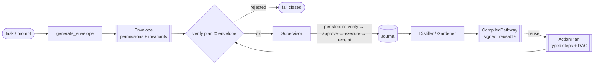
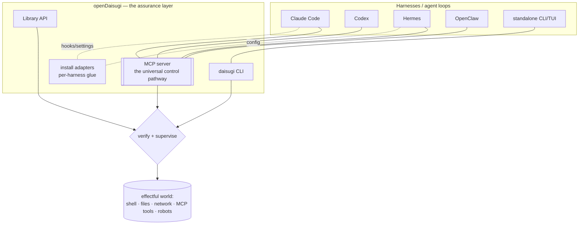
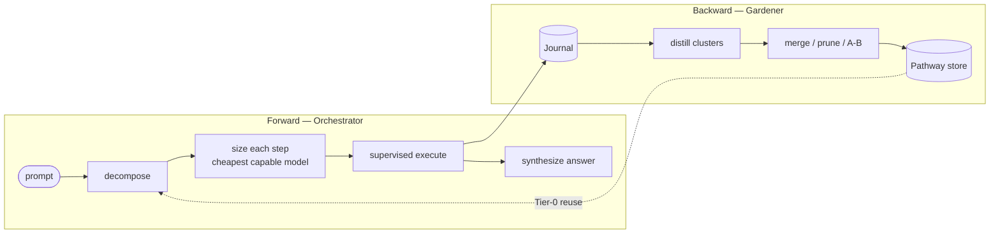
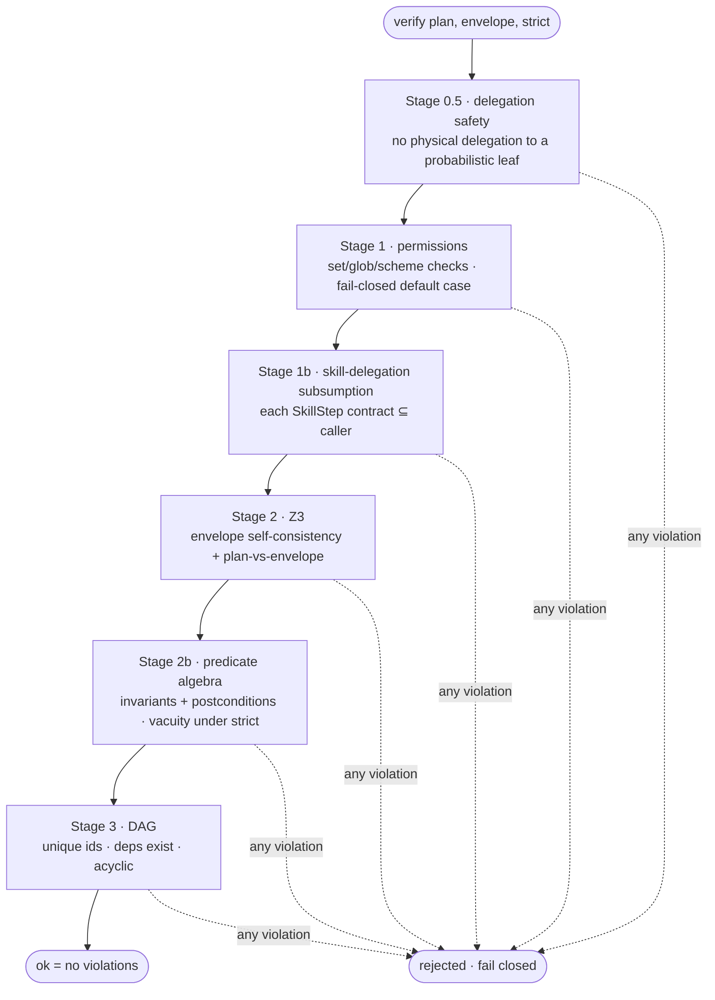
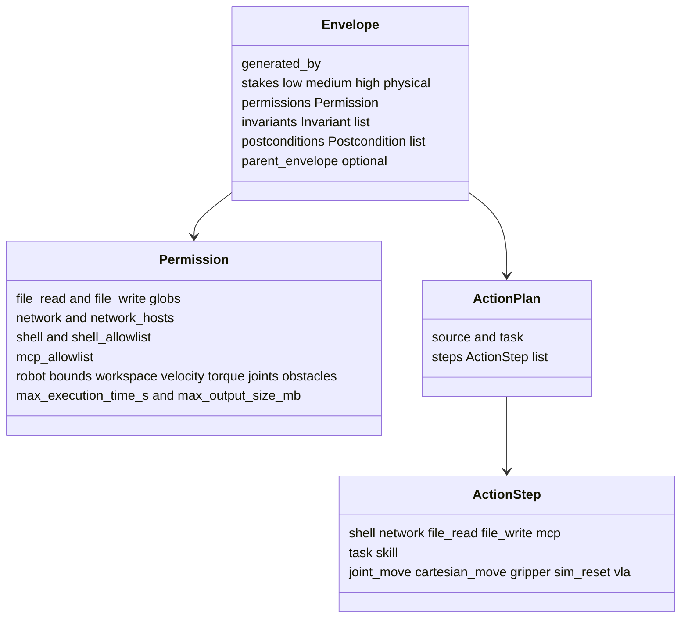
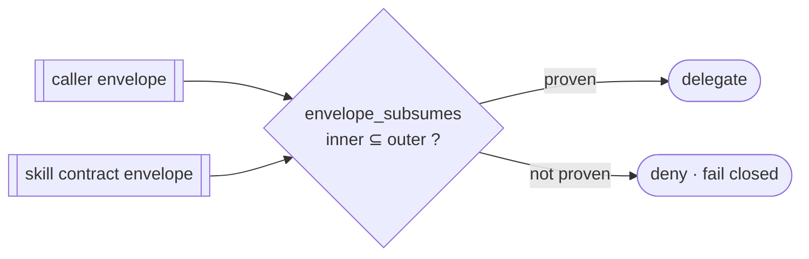
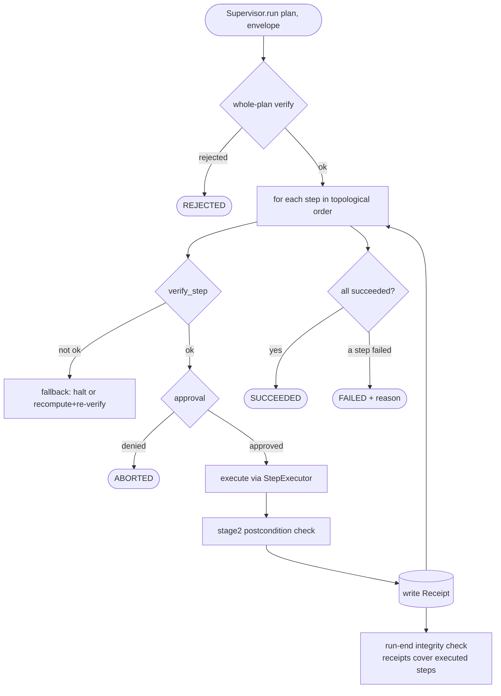

# Architecture Overview

> The one-page mental model of openDaisugi, then the diagrams that make it concrete.
> For *why* each load-bearing decision was made, see [`docs/adr/`](../adr/). For the
> per-subsystem reference docs, see the rest of [`docs/`](../).

## What this is, in one paragraph

openDaisugi is a **runtime-assurance layer for agent actions**. An LLM (or a
harness driving one) proposes what it wants to do; openDaisugi turns that into a
typed **plan**, proves the plan stays inside an explicitly declared **envelope**
of permissions *before anything runs* (using Z3, not heuristics), then executes it
**step by step under a supervisor** that re-checks each step, records a tamper-
evident **receipt**, and **journals** the run. Successful runs are later
**distilled** into reusable, signed **pathways**. It is a *library and a layer* —
not an agent, not a harness. Harnesses call it.

## The spine (the single most important picture)

Every feature hangs off one pipeline. Read this and you understand 80% of the codebase.

Two facts to hold onto:

1. **Verification is fail-closed and happens *before* execution** — an unprovable
   plan is rejected, an undeclared capability is denied. See
   [ADR-0001](../adr/0001-fail-closed-default.md).
2. **The envelope is a contract, not a config.** `verify(plan, envelope)` is a
   mathematical claim: *this plan can only do things this envelope permits.* The
   same claim, applied to two envelopes, is `envelope_subsumes(outer, inner)` —
   the proof that a delegation is safe. See
   [ADR-0003](../adr/0003-envelope-as-contract.md).

## Where it sits (system context)

openDaisugi is a **layer**, deliberately not a harness. It plugs into whatever is
already driving the LLM.

- **MCP is the universal control pathway** — any MCP-capable harness reaches the
  same verify/orchestrate tools. `install.py` provides **per-harness adapters**
  (Claude Code hooks, Hermes config, generic MCP). Local LLMs plug in via Tier-1
  providers. See [ADR-0004](../adr/0004-layer-not-harness.md).
- openDaisugi never becomes the thing driving the model. It is the gate the driver
  passes actions through.

## The two loops

The system has a **forward loop** (turn a prompt into a verified answer) and a
**backward loop** (turn finished runs into reusable knowledge). They meet at the
Journal and the pathway store.

- **Forward** (`orchestrator.py`, `decomposer.py`, `model_sizer.py`,
  `budget.py`, `synthesizer.py`): a prompt becomes a typed DAG, each step routes
  to the cheapest capable model within a live token budget, everything runs under
  the supervisor, outputs are synthesized. Repeat prompts can reuse a distilled
  pathway (Tier-0) instead of re-decomposing.
- **Backward** (`distiller.py`, `gardener/`, `pathway*.py`): journaled traces are
  clustered and distilled into `CompiledPathway`s — a generalized plan template +
  the intersected envelope that provably covers it. The Gardener merges near-
  duplicates, prunes stale ones, and A/B-tests. Pathways are signed and shareable.

## Inside `verify()` — the staged gate

`verify(plan, envelope)` is the heart. It is a sequence of cheap-to-expensive
gates; the first stage to find a violation short-circuits. Static SMT (Z3) checks
only run once the cheap set/string checks pass.

- Stage 1 has a **fail-closed default case**: an unknown custom `@step_type` with
  no handler is rejected under strict, never waved through.
- The Z3 layer (`subsumption.py`, `z3_checks.py`, `predicate_z3.py`,
  `regex_to_z3.py`) is where the real proofs live — glob/host/scope subsumption,
  robotics trajectory bounds, predicate-algebra invariants. See
  [ADR-0002](../adr/0002-z3-over-heuristics.md).

## The data model (the contract you're proving things about)

*(12 built-in `ActionStep` types; custom types via `@step_type` must carry a
verification story — see [ADR-0001](../adr/0001-fail-closed-default.md).)*

- **Stakes gate behavior**: `physical` forbids probabilistic primitives and
  demands backing bounds; `strict` mode (auto-on for high/physical) rejects
  opaque/vacuous invariants instead of waving them through.
- New step types are an extension point (`@step_type`), but every effectful type
  must have a verification story — no free pass. See
  [`docs/step-vocabulary.md`](../step-vocabulary.md).

## Delegation & subsumption (skills-as-contracts)

The same machinery that verifies a plan verifies a *delegation*. A skill ships a
contract (its own envelope); a caller may run it only if the caller's envelope
**subsumes** it.

`envelope_subsumes` proves containment across **shell, file, network, MCP, and
robot capabilities** (Z3 witness search + set logic). Signed contracts add
provenance: with `trusted_signers` supplied, an unsigned or untrusted contract is
denied. This is the substrate for safe sub-agents and shared pathways.

## Supervised execution (what actually runs)

`verify()` proves the *whole plan* is safe; the **Supervisor** still re-checks each
step at execution time and produces evidence.

- **Executors** implement one protocol (`run(step, *, timeout_s, max_output_bytes)
  -> ExecutorResult`): `SubprocessExecutor` (bounded output, process-group kill),
  `NetworkExecutor` (http(s)-only, wall-clock bound), file executors (symlink-safe),
  `DelegatingExecutor` (LLM task steps), MuJoCo/VLA (robotics), and `DryRunExecutor`.
- **Approval** is a strategy stack (allowlist → env → TTY → deny). Live/high-stakes
  surfaces require an explicit opt-in; they never auto-approve a caller-supplied plan.
- **Receipts + integrity** make silent step-skips detectable after the fact.

## Consumption surfaces

| Surface | Module | Use it for |
|---|---|---|
| Library API | `__init__.py` (`Daisugi`, `verify`, `generate_envelope`, `orchestrate`) | Embedding in Python programs / other tools |
| CLI | `cli.py` (`daisugi …`) | Standalone scripting, one-shot verify/run/orchestrate/tend |
| MCP server | `mcp_server.py` | **Any MCP-capable harness** (Claude Code, Codex, Cursor, Pi…) |
| Install adapters | `install.py` | Per-harness wiring (Claude Code hooks, Hermes config, MCP config) |

The LLM backend is pluggable (`llm.py`): `litellm` (API-key) or `claude-code`
(`claude -p`, no API key, exact cost). See
[`reference` docs](../integrations.md) and
[ADR-0006](../adr/0006-claude-p-backend.md).

## Module map (where to look)

| Concern | Modules |
|---|---|
| **Data model** | `models.py`, `permissions.py`, `_invariant_types.py`, `predicate.py`, `aliases.py`, `step_vocabulary.py` |
| **Verification core** | `verify.py`, `subsumption.py`, `z3_checks.py`, `predicate_z3.py`, `regex_to_z3.py`, `dag.py`, `vacuity.py`, `inheritance.py`, `stage2.py`, `contracts.py`, `interpreter_parse.py` |
| **Execution** | `supervisor.py`, `executor.py`, `delegating_executor.py`, `orchestration_executors.py`, `executor_mujoco.py`, `vla_executor.py`, `approval.py`, `fallback.py`, `run_session.py`, `refinement.py` |
| **Envelope generation** | `envelope.py`, `envelope_cache.py`, `tier1.py`, `thinking.py`, `defaults.py` |
| **Journal & distillation** | `journal.py`, `ingest.py`, `distiller.py`, `gardener/`, `pathway*.py`, `git_pathway_store.py`, `portability.py`, `signing.py`, `accounting.py` |
| **Orchestration (forward)** | `orchestrator.py`, `decomposer.py`, `synthesizer.py`, `model_sizer.py`, `budget.py`, `routing.py` |
| **Swarm / multi-robot** | `swarm.py` |
| **LLM backends** | `llm.py`, `claude_code_llm.py`, `llm_check.py` |
| **Local models / hardware** | `hardware.py`, `local_setup.py`, `model_registry.py`, `onboarding.py` |
| **Surfaces / integration** | `cli.py`, `mcp_server.py`, `install.py`, `hook.py`, `config.py`, `subagent.py`, `skill_paths.py` |

## Invariants that must always hold

These are the rules the whole design depends on. Breaking one is a design
regression, not a feature. (Enforced in tests; recorded as ADRs.)

1. **Fail closed.** Unprovable ⇒ rejected. Undeclared ⇒ denied. A fail-*open* in
   the verification core is the worst bug class here.
2. **Verify before execute.** No effect happens before its plan is proven inside
   its envelope; each step is re-checked at run time.
3. **The envelope is the authorization ceiling.** Reused pathways, delegated
   skills, and MCP-supplied plans are all bounded by the *caller's* envelope,
   never their own.
4. **Layer, not harness.** openDaisugi gates actions; it does not drive the model.
5. **Provenance is enforceable.** Signed pathways/contracts verify against a
   *local, out-of-band* trust anchor — never one fetched from the source it
   authenticates.
