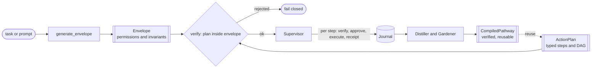
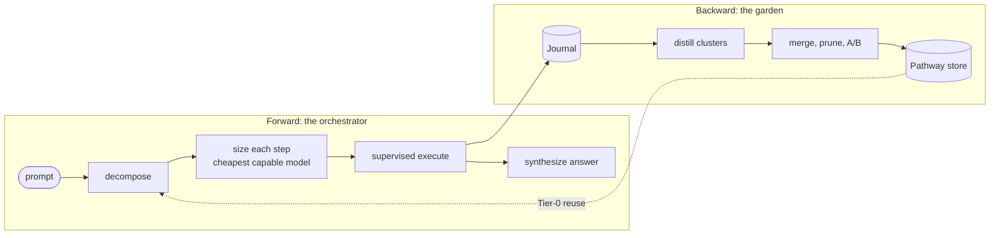
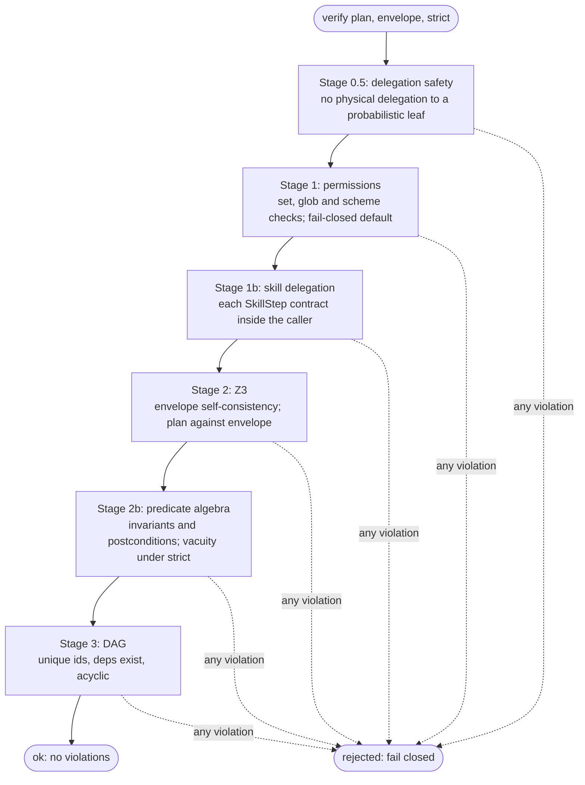
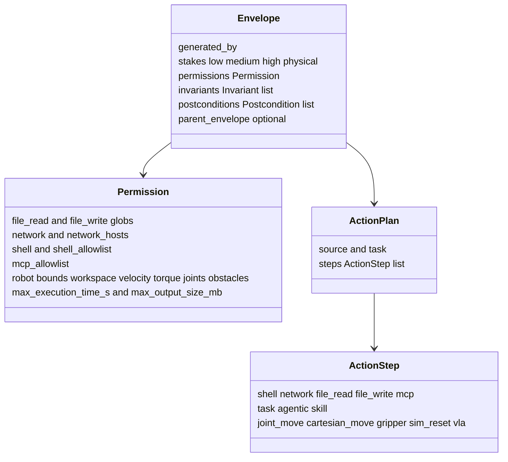
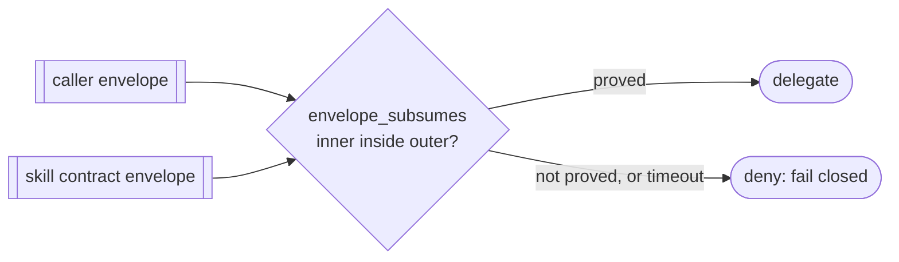
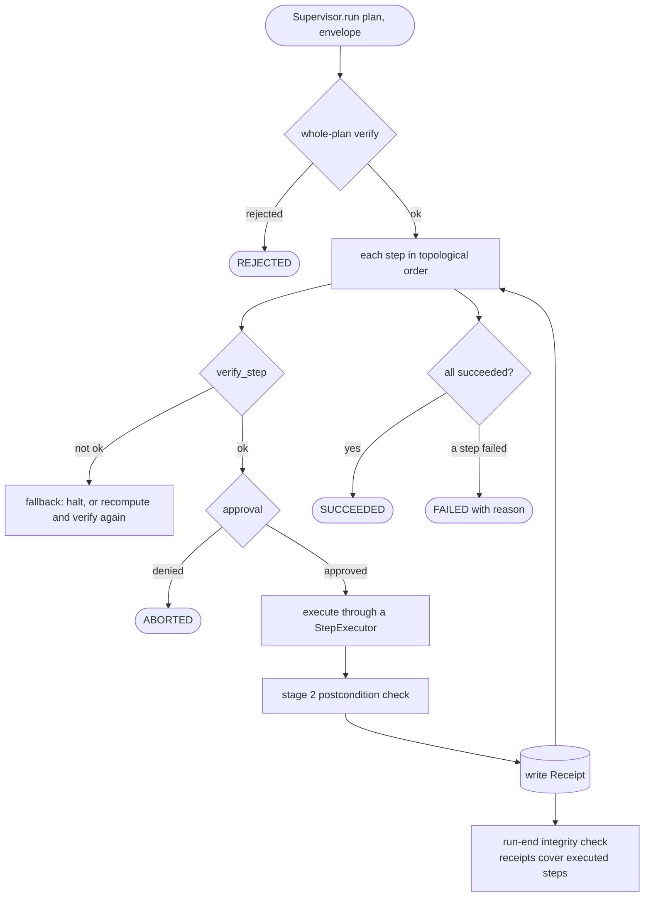

# Architecture overview

> The one-page mental model of openDaisugi, then the diagrams that make it concrete.
> For why each load-bearing decision was made, see [`docs/adr/`](../adr/). For status per
> language, see [feature-status.md](../feature-status.md). Refreshed 2026-09-26.

## What this is, in one paragraph

openDaisugi checks what AI agents do before they do it, and learns from what they did. A
model proposes an action. daisugi turns it into a typed **plan** or a one-step record,
proves with Z3 that it stays inside a declared **envelope** of permissions **before it
runs**, and denies what it cannot prove. It **journals** every action and verdict. The
**garden** distils repeated successes into reusable, verified **pathways**. The throughline
is one sentence: **separate what is allowed from what is decided.** A model decides; the
envelope says what is allowed; a proof checks each action against the envelope.

## The three parts (ADR-0020)

[ADR-0020](../adr/0020-layer-floor-loop.md) splits openDaisugi into three parts.

| Part | What it is | Language today | Rule |
|---|---|---|---|
| **daisugi** | The gate (allow, deny or ask for one call), the verifier, the journal and the garden. Also the gateway and the router, which save tokens. | Python (the oracle), Go, Rust | daisugi stays importable alone. It never imports the floor or a loop (`tests/test_layer_boundary.py`). |
| **coppice** | The floor: panes, the agents in them and their state, in a terminal, a browser or a phone. | Go | The floor supervises; it does not decide. State comes from the gate first, the screen second. |
| **the loop** | Whatever harness runs in a pane: Claude Code, Codex, pi, OpenCode, or sprig, our own. | sprig is Go | sprig and weave are on hold with the owner. grove is retired: coppice replaced it. |

"The gate" means only the allow-and-deny part. daisugi has three modes, shown on screen in
words: **enforcing** (checks, blocks, journals), **watching** (checks and journals, never
blocks; the config value is `audit`) and **off**.

## The whole system in one picture

Boxes are processes. Lines are the only ways they talk. Every arrow into daisugi is a
boundary where an unknown or failed answer means **deny**.

```text
                 the operator
       terminal ──┐        ┌── browser, phone (TLS, bearer token)
                  │        │
          ┌───────┴────────┴──────────────────────────────┐
          │ coppice server (Go)                           │
          │   unix socket: mode 0600, dir 0700,           │
          │   peer uid checked on every connection        │
          │   coppice web: loopback, or `web serve` + TLS │
          └──┬──────────────┬──────────────────┬──────────┘
             │ pty          │ starts           │ COPPICE_SOCK, COPPICE_PANE,
             │              │                  │ COPPICE_DATA_DIR in each pane
             v              v                  │
   ┌──────────────────┐  ┌──────────────────┐  │
   │ a pane: harness  │  │ daisugi voice    │  │
   │ (claude, codex,  │  │ serve (Python)   │  │
   │  pi, opencode,   │  │ loopback + token │  │
   │  sprig)          │  └──────────────────┘  │
   └──┬──────────┬────┘                        │
      │          │ model requests              │
      │ each     │ (base_url)                  │
      │ tool     v                             │
      │ call  ┌────────────────────────────┐   │
      │       │ daisugi gateway            │   │
      │       │ 127.0.0.1:8787 by default  │──────> model provider
      │       │ rules router, meter,       │   │
      │       │ journal; Switchyard child  │   │
      │       └────────────────────────────┘   │
      v                                        │
   ┌───────────────────────────────────────┐   │
   │ the gate hook, one process per call:  │   │
   │ `daisugi gate check --format F ...`   │   │
   │ stdin: the call as JSON               │───┘ state report
   │ out: exit code and stdout in F's      │     (verdict, clause, tokens)
   │ contract; exit 2 = deny               │
   │ Go and Rust: parent + child, verdict  │
   │ only in a nonce frame on fd 3         │
   └──────────────┬────────────────────────┘
                  │ reads and writes
                  v
   ┌───────────────────────────────────────┐
   │ files on disk (~/.opendaisugi)        │
   │ gate root: envelopes/<id>.json,       │
   │ DISARMED, config.yaml, audit log,     │
   │ asks; journal; pathways.db; captures  │
   └───────────────────────────────────────┘

   pi and OpenCode extensions ── unix socket gate.sock ──> resident gate
                                                           (Python only today)
   any MCP harness ── stdio ──> daisugi MCP server (Python only today)
```

## The process boundaries

| Boundary | Who is on each side | The contract | How it fails |
|---|---|---|---|
| **The gate hook** | A harness, and a `daisugi gate check` process it starts for each tool call | The call as JSON on stdin. The answer is the format's own contract: for `claude`, exit 2 denies and stdout JSON carries `updatedInput` for an operator edit; `hermes` and `openclaw` get a block body. Formats: `claude` (also used for Codex), `hermes`, `openclaw`, and exit-code formats for pi and OpenCode. | Every failure path denies: unknown tool, bad input, internal error, a slow verifier. The gate owns a deadline inside the host's hook timeout, because a host timeout fails open. In Go and Rust a child decides; the parent takes a verdict only from a complete frame on fd 3 with its nonce, and a crash, a signal or a hang becomes the deny contract. stdin is read up to 16 MiB. |
| **The resident gate** | The pi and OpenCode extensions, and `daisugi gate serve` | A unix socket `gate.sock` owned by this uid, mode 0600. A reply is `{"v":1,"stdout":...,"stderr":...,"exit_code":...}`. The caller's pane comes from `SO_PEERCRED`, never from the request body. | The extension denies when the socket is missing or slow (5 s). Python, Go and Rust each serve it (`daisugi gate serve`, G2-1 in clients/ADJUDICATIONS.md); with no server running, pi and OpenCode deny every call. |
| **The gateway** | A harness's model client (through `ANTHROPIC_BASE_URL`, Codex's provider, OpenClaw's provider), `daisugi gateway`, and the upstream model | Anthropic Messages and OpenAI Chat Completions, buffered and streamed, on loopback. It routes whole turns. Routing changes only the body's `model` field (`gateway_pipeline.py`); the gateway never adds, drops or compresses content. Switchyard runs as a managed child on 127.0.0.1. `POST /_reload` works from loopback only. | A body whose shape the router cannot read is forwarded untouched and not journaled, as the oracle does. The upstream goes through the proxy the environment names. |
| **The coppice socket** | The operator's client, panes, plugins, and the gate hook reporting state | One unix socket, mode 0600 in a 0700 directory; the peer uid must be the server's. Native framing or JSON-RPC 2.0. Roles: operator, pane, plugin. Only the operator may allow an ask. The protocol is proved by the corpus in `harness/coppice/testdata/protocol`. | A foreign uid gets one `unauthorized` line and the connection closes. There is no token and no TLS on the socket: the uid check is the whole of the auth. Linux only. |
| **coppice web** | A browser or phone, and the coppice server | `coppice web` serves on loopback and opens the browser signed in. `coppice web serve` serves the phone with TLS from `tailscale cert`, a local CA, or files, and a bearer token. ntfy push on the change to blocked. | The web token, the CA keys and the voice token live in the coppice data directory, which the gate guards from agents even under a custom `--data-dir`. |
| **Voice** | coppice and `daisugi voice serve` | A loopback port coppice picks, and a token in `<data dir>/voice/token`. Transcribed text lands in the input line without Enter. | Needs Python's voice extra. When voice cannot run, the floor says why and offers the fix. |

## The binaries and what each holds

| Binary | Language | What it holds |
|---|---|---|
| `daisugi` (Python CLI, package `opendaisugi`) | Python | Everything: the oracle. Also the parts no port has yet: model-written envelopes, the orchestrator, the MCP server, the dashboard, the resident gate, voice, deeds, batch, strata, signing. |
| `daisugi` | Go | The gate commands and `install --gate`, `pathways`, the garden (`gardener`, `tend`, `hook auto-tend`, `distill-repeats`), the gateway and router commands, `status`, `config`, `start --no-ui`, `journal`. No Python at run time. Links only glibc. |
| `daisugi` | Rust | The same as the Go binary except `status`, `config`, `start` and `journal`. Links libc, libm and libgcc_s. |
| `daisugi-gate` | Go, Rust | The gate hook alone. About 32 MB in each language. |
| `conform` | Go, Rust | The verifier conformance client ([conformance.md](../spec/conformance.md)). TypeScript and Lean 4 clients also exist (`clients/ts`, `clients/lean`). |
| `coppice` | Go | The floor: client and server in one binary, the TUI, the web and phone client. Links libghostty-vt through cgo. |
| `sprig`, `sprig-hook`, `sprig-mcp`, `weave` | Go | The loop and its early relatives. On hold. The gate is off unless `--gate` is given. |

The Go and Rust `daisugi` link Z3 5.1.0, tree-sitter and tree-sitter-bash statically, from
pinned sources. Go builds them with `clients/go/scripts/native.sh`. Rust builds Z3 through the
`z3-src` crate, with `clients/rust/tools/z3-build-env.sh` and the libc++ from the same native
prefix. Rust's tree-sitter runtime is 0.25.10, against 0.26.0 in Go and Python (ruling DS-8
aligns them). `scripts/install.sh` builds `daisugi`,
`coppice` and `sprig` and puts them in `~/.local/bin`. `scripts/release.sh` builds a tarball;
a check fails the build if any binary names a path of the box that built it.

## How the ports prove themselves: the conformance method

Python is the oracle. A port is right when it does what the oracle does, at process
boundaries.

1. **Golden cases, synthetic and committed.** For each part there is a generator
   (`clients/<kind>_cases.py`) that runs the Python oracle and writes cases to
   `clients/fixtures/<kind>/`: a hook call and every stream, log and file after it; a CLI
   command and the tree after it; a gateway turn against a fake upstream and the bytes the
   upstream got. Cases use fake paths, so they can be published. At HEAD: 1,310 gate, 472
   CLI, 158 pathway CLI plus 24 find and 577 verify-message, 215 garden, 223 gateway.
   These counts come from compares run before the Python security fixes of 2026-09-26 (f9e202e7, 92f87edf, 31871c4d, 6a0ad499, 1fad0036). Until the Go and Rust mirrors land, a live `--oracle` compare will show the ports behind on those rules.
2. **Compare structurally.** `clients/<kind>_compare.py --binary B` runs a port over every
   case. Verdicts and files must match; wording may differ only where a ruling says so.
   `--oracle` reruns the oracle live to show the fixture is current. A guard checks that
   Python can read every journal and store the port wrote.
3. **Seeded fuzz.** Shell commands under three envelopes, heredocs, multi-line and non-ASCII
   text, envelopes with predicates and robotics bounds, pathway stores, gateway turn
   sequences. Each seed is replayable.
4. **The frozen local corpus.** About 11,450 verifier cases from the owner's real
   transcripts. It holds real local paths, so it is never published. It checks the verifier
   clients.
5. **Never looser than the oracle.** A port may refuse a case it cannot answer (exit 2, one
   line, nothing changed) only where a ruling allows it. It may never allow what the oracle
   denies. Every disagreement is a finding in the port or in the oracle, and gets a ruling in
   [`clients/ADJUDICATIONS.md`](../../clients/ADJUDICATIONS.md). Many oracle fail-opens were
   found this way and fixed in Python first.
6. **Speed budgets.** A gate check under 10 ms at p50 (Go 8.8 ms, Rust 6.1 ms; Python about
   430 ms), `--help` under 20 ms, under 5 ms added per gateway turn.

What this method proves: the ports **match** the oracle. What it does not prove: that the
oracle's answers are **useful** on real work. That needs real traffic.

## The spine (Python oracle)

The rest of this page describes the Python oracle, where every part exists. Every feature
hangs off one pipeline.


```mermaid
flowchart LR
    prompt([task or prompt]) --> gen[generate_envelope]
    gen --> env[[Envelope<br/>permissions and invariants]]
    plan[[ActionPlan<br/>typed steps and DAG]] --> verify
    env --> verify{verify: plan inside envelope}
    verify -- rejected --> stop([fail closed])
    verify -- ok --> sup[Supervisor]
    sup -->|per step: verify, approve, execute, receipt| journal[(Journal)]
    journal --> distill[Distiller and Gardener]
    distill --> pathway[[CompiledPathway<br/>verified, reusable]]
    pathway -.reuse.-> plan
```

Two facts to hold onto:

1. **Verification fails closed and comes before execution.** An unprovable plan is rejected.
   An undeclared capability is denied. See [ADR-0001](../adr/0001-fail-closed-default.md).
2. **The envelope is a contract, not a config.** `verify(plan, envelope)` claims: this plan
   can only do what this envelope permits. The same claim between two envelopes is
   `envelope_subsumes(outer, inner)`, the proof that a delegation is safe. See
   [ADR-0003](../adr/0003-envelope-as-contract.md).

The live gate is the same check on a one-step record: the hook turns a tool call into a
record (`hook.py`), and `verify` checks it against the registered envelope: the `default`
envelope, or the envelope of the session the hook is pinned to. A session id in the payload
never selects an envelope (Python today; Go and Rust in progress).

## The two loops

The **forward loop** turns a prompt into a verified answer. The **backward loop** turns
finished runs into reusable knowledge. They meet at the journal and the pathway store.


```mermaid
flowchart LR
    subgraph forward [Forward: the orchestrator]
        p([prompt]) --> dec[decompose]
        dec --> sz[size each step<br/>cheapest capable model]
        sz --> ex[supervised execute]
        ex --> syn[synthesize answer]
    end
    subgraph backward [Backward: the garden]
        j[(Journal)] --> dl[distill clusters]
        dl --> mg[merge, prune, A/B]
        mg --> ps[(Pathway store)]
    end
    ex --> j
    ps -.Tier-0 reuse.-> dec
```

- **Forward** (`orchestrator.py`, `decomposer.py`, `model_sizer.py`, `budget.py`,
  `synthesizer.py`): a prompt becomes a typed DAG; each step goes to the cheapest capable model
  inside a live token budget; everything runs under the supervisor. A repeated prompt can
  reuse a pathway (Tier-0). Python only; port stage K.
- **Backward** (`distiller.py`, `gardener/`, `pathway*.py`): journal traces are clustered and
  distilled into a `CompiledPathway`, a plan template plus the intersected envelope that
  covers it. The garden merges near-duplicates, prunes stale ones and A/B-tests. In Python,
  Go and Rust.

## Inside `verify()`: the staged check

`verify(plan, envelope)` runs cheap checks first. The first stage to find a violation stops
the run. Z3 runs only after the set and string checks pass.


```mermaid
flowchart TB
    start([verify plan, envelope, strict]) --> s05[Stage 0.5: delegation safety<br/>no physical delegation to a probabilistic leaf]
    s05 --> s1[Stage 1: permissions<br/>set, glob and scheme checks; fail-closed default]
    s1 --> s1b[Stage 1b: skill delegation<br/>each SkillStep contract inside the caller]
    s1b --> s2[Stage 2: Z3<br/>envelope self-consistency; plan against envelope]
    s2 --> s2b[Stage 2b: predicate algebra<br/>invariants and postconditions; vacuity under strict]
    s2b --> s3[Stage 3: DAG<br/>unique ids, deps exist, acyclic]
    s3 --> ok([ok: no violations])
    s05 & s1 & s1b & s2 & s2b & s3 -. any violation .-> rej([rejected: fail closed])
```

- Stage 1 has a fail-closed default: an unknown custom `@step_type` with no handler is
  rejected under strict.
- The Z3 code (`subsumption.py`, `z3_checks.py`, `predicate_z3.py`, `regex_to_z3.py`) holds
  the proofs: glob, host and scope subsumption, robotics bounds, predicate invariants. See
  [ADR-0002](../adr/0002-z3-over-heuristics.md).
- Subsumption checks stakes (never lower), the custom step list (a subset) and the time and
  output budgets (never larger) before Z3. A Z3 unknown is a violation, not a pass.

## The data model


```mermaid
classDiagram
    class Envelope {
        generated_by
        stakes  low medium high physical
        permissions  Permission
        invariants  Invariant list
        postconditions  Postcondition list
        parent_envelope  optional
    }
    class Permission {
        file_read and file_write globs
        network and network_hosts
        shell and shell_allowlist
        mcp_allowlist
        robot bounds  workspace velocity torque joints obstacles
        max_execution_time_s and max_output_size_mb
    }
    class ActionPlan {
        source and task
        steps  ActionStep list
    }
    class ActionStep {
        shell network file_read file_write mcp
        task agentic skill
        joint_move cartesian_move gripper sim_reset vla
    }
    Envelope --> Permission
    Envelope --> ActionPlan
    ActionPlan --> ActionStep
```

- **Stakes set the behavior.** `physical` forbids probabilistic steps and needs backing
  bounds. Strict mode (on by default at high and physical) rejects opaque or vacuous
  invariants.
- New step types come through `@step_type`. Every step type with an effect must have a way
  to be verified. See [`docs/step-vocabulary.md`](../step-vocabulary.md).

## Delegation and subsumption

The same check that verifies a plan verifies a delegation. A skill carries a contract (its
own envelope). A caller may run it only if the caller's envelope **subsumes** it.


```mermaid
flowchart LR
    caller[[caller envelope]] --> subs{envelope_subsumes<br/>inner inside outer?}
    skill[[skill contract envelope]] --> subs
    subs -- proved --> allow([delegate])
    subs -- not proved, or timeout --> deny([deny: fail closed])
```

`envelope_subsumes` proves containment across shell, file, network, MCP and robot
capabilities. With `trusted_signers`, an unsigned or untrusted contract is denied. The
proposed delegation tree ([design-delegation-tree.md](../plans/2026-09-24-omarchy/design-delegation-tree.md),
Proposed) uses the same relation on every parent-to-child edge.

## Supervised execution

`verify()` proves the whole plan. The Supervisor checks each step again when it runs and
writes evidence.


```mermaid
flowchart TB
    run([Supervisor.run plan, envelope]) --> wv{whole-plan verify}
    wv -- rejected --> rj([REJECTED])
    wv -- ok --> loop[each step in topological order]
    loop --> vs{verify_step}
    vs -- not ok --> fb[fallback: halt, or recompute and verify again]
    vs -- ok --> ap{approval}
    ap -- denied --> ab([ABORTED])
    ap -- approved --> exec[execute through a StepExecutor]
    exec --> s2[stage 2 postcondition check]
    s2 --> rec[(write Receipt)]
    rec --> loop
    loop --> done{all succeeded?}
    done -- yes --> ok([SUCCEEDED])
    done -- a step failed --> fail([FAILED with reason])
    rec --> integ[run-end integrity check<br/>receipts cover executed steps]
```

- **Executors** share one protocol (`run(step, *, timeout_s, max_output_bytes)`):
  `SubprocessExecutor` (bounded output, process-group kill), `NetworkExecutor`, file
  executors (symlink-safe), `DelegatingExecutor` and `AgenticExecutor` (model steps),
  MuJoCo and VLA (robotics), and `DryRunExecutor`.
- **Approval** is a stack (allowlist, env, TTY, deny). High-stakes surfaces need an explicit
  opt-in.
- **Receipts** make a skipped step visible after the fact.

## Python module map

| Concern | Modules |
|---|---|
| **Data model** | `models.py`, `permissions.py`, `_invariant_types.py`, `predicate.py`, `aliases.py`, `system_aliases.py`, `step_vocabulary.py` |
| **Verification core** | `verify.py`, `subsumption.py`, `z3_checks.py`, `predicate_z3.py`, `regex_to_z3.py`, `dag.py`, `vacuity.py`, `inheritance.py`, `stage2.py`, `contracts.py`, `interpreter_parse.py` |
| **The gate** | `gate.py`, `hook.py`, `gate_server.py`, `gate_client.py`, `effects.py`, `floor_config.py`, `shell_decompose.py`, `ask.py`, `rank_rule.py` |
| **Execution** | `supervisor.py`, `executor.py`, `delegating_executor.py`, `orchestration_executors.py`, `executor_mujoco.py`, `vla_executor.py`, `approval.py`, `fallback.py`, `run_session.py`, `refinement.py`, `deeds.py`, `batch.py` |
| **Envelope generation** | `envelope.py`, `envelope_cache.py`, `tier1.py`, `thinking.py`, `defaults.py` |
| **Journal and distillation** | `journal.py`, `ingest.py`, `parsers/`, `distiller.py`, `gardener/`, `pathway*.py`, `git_pathway_store.py`, `portability.py`, `signing.py`, `accounting.py`, `strata.py` |
| **Orchestration (forward)** | `orchestrator.py`, `decomposer.py`, `synthesizer.py`, `model_sizer.py`, `budget.py`, `routing.py` |
| **Token saving** | `gateway.py`, `gateway_asgi.py`, `gateway_pipeline.py`, `gateway_journal.py`, `gateway_answers.py`, `gateway_recall.py`, `router_switchyard.py` |
| **Swarm and robots** | `swarm.py` |
| **Model backends** | `llm.py`, `claude_code_llm.py`, `llm_check.py` |
| **Local models and hardware** | `hardware.py`, `local_setup.py`, `model_registry.py`, `onboarding.py` |
| **Surfaces** | `cli.py`, `mcp_server.py`, `install.py`, `config.py`, `subagent.py`, `skill_paths.py`, `harness_pi/`, `harness_opencode/` |
| **Floor side (exempt from the boundary test)** | `floor/`, `voice/`, `cockpit.py`, `dashboard.py`, `start.py`, `tui*.py` |

## Rules that must always hold

Breaking one is a design regression, not a feature. Each is enforced by tests and recorded
in an ADR.

1. **Fail closed.** Unprovable means rejected. Undeclared means denied. A timeout, a crash
   or an unknown answer means deny. A fail-open in the checking code is the worst bug class
   here.
2. **Verify before execute.** No effect happens before its plan or call is proved inside its
   envelope.
3. **The envelope is the ceiling of authority.** Reused pathways, delegated skills,
   sub-agents and MCP-supplied plans are bounded by the caller's envelope, never their own.
   A payload's session id never selects an envelope (Python today; Go and Rust in
   progress).
4. **daisugi stays importable alone.** It checks actions; it does not drive the model. The
   floor supervises; it does not decide ([ADR-0020](../adr/0020-layer-floor-loop.md)).
5. **Provenance is enforceable.** Signed pathways and contracts verify against a local trust
   anchor, never one fetched from the source it authenticates.
6. **A port is never looser than the oracle.** Where it cannot decide, it denies with a
   reason.
