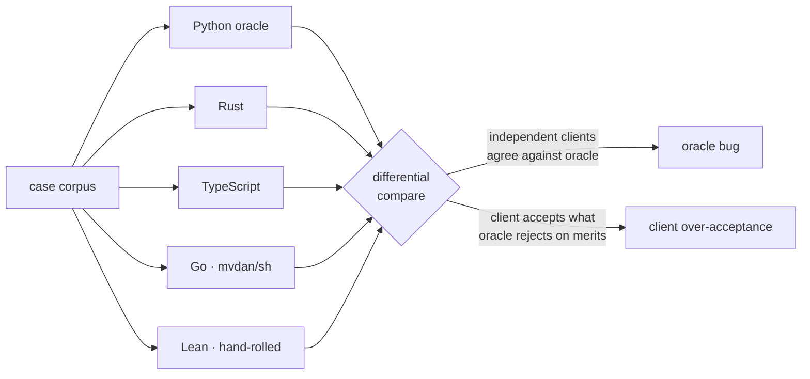
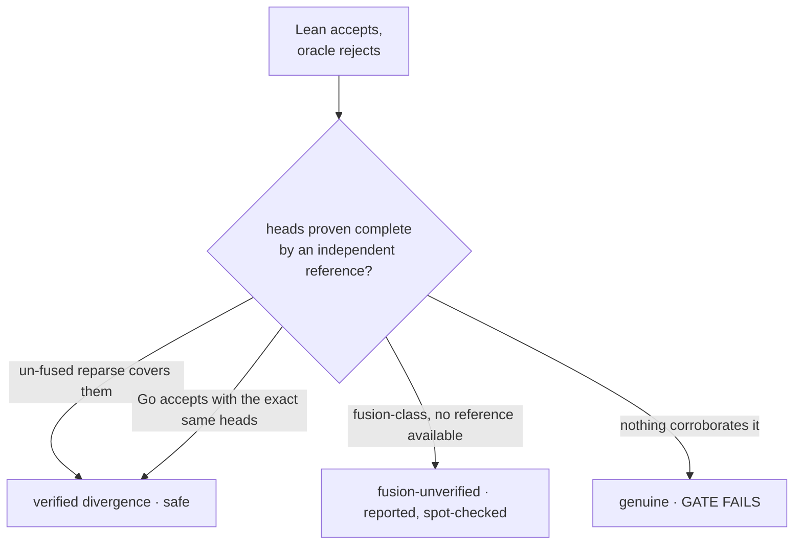

# Verifier client diversity

openDaisugi's verifier decides whether an LLM-proposed action stays inside a
checkable safety envelope. That decision is the most safety-critical code in the
system, so it should not rest on a single implementation. Ethereum runs many
independent clients so one consensus bug can't take the whole network down; the
same idea applies here. We built the verifier five times, in five languages, and
run every one against the same corpus to catch the bug that any single
implementation would have hidden.

This page is the story of what that cross-checking found: the bugs it caught in
the reference, a campaign to close the gap between the strictest client and the
reference, and — most recently — using the independent clients to *correct* the
reference rather than merely guard against it.

> The Python implementation is the **oracle** — the reference every other client
> is measured against. "Match" below always means "produced the oracle's exact
> verdict," so 100% means *agrees with the reference*, not *provably correct*.
> The whole point of the exercise is that the reference itself can be wrong, and
> a second parser is how you find out.

## The five clients

All five speak one wire protocol (a case as JSON on stdin, a verdict as JSON on
stdout) and are scored on one content-addressed corpus of **11,450 cases**
(11,089 shell-decomposition cases, 361 verification cases). They were written to
be genuinely independent: different languages, different shell parsers, different
authors' habits.

| Client | Shell parser | Conformance | Cold start | Role |
|---|---|---:|---:|---|
| **Python** | tree-sitter-bash | oracle | ~560 ms | the reference |
| **Rust** | tree-sitter-bash (native) | **11,450 / 11,450** | ~1.7 ms | C ABI · wasm · embedding |
| **TypeScript** | web-tree-sitter | **11,450 / 11,450** | ~850 ms | browser · Node |
| **Go** | `mvdan/sh` (independent) | 11,447 / 11,450 | ~2.2 ms | fastest throughput |
| **Lean 4** | hand-rolled subset | 11,233 / 11,450 | ~47 ms | machine-checked core |

Those are the current numbers, after the reference itself was corrected (the
[statement-fusion repair](#repairing-the-reference-not-just-guarding-it) below).
The corpus is the same 11,450 commands throughout; correcting the reference on
147 of them is what moved Go from 11,394 to 11,447 and Lean from 11,097 to
11,233 — most of that movement was clients that were *already right* finally
agreeing with a reference that had caught up to them.

Rust and TypeScript port the oracle's own tree-sitter grammar, so they reproduce
its verdicts exactly — including the cases where tree-sitter is *wrong* (more on
that below). Go and Lean use genuinely different parsers, which is what makes
their disagreements worth reading.

The Lean client is deliberately the odd one out. It carries no grammar dependency
and no solver, because its real deliverable is three machine-checked theorems
with zero `sorry` — soundness of head extraction, the empty-allowlist base case,
and strict-mode monotonicity. Its hand-rolled parser started life covering only a
small, safe subset of shell, which is why it began this campaign at
**8,882 / 11,450** — trailing the others by design.

## How a second parser earns its keep

The original build had one job: run all five clients over the corpus and read the
disagreements. Where two *independent* parsers (Go's `mvdan/sh` and Lean's
hand-rolled one) agreed with each other but disagreed with the oracle on the same
cases, that was the strongest possible signal that the oracle had the bug.



It paid off. Three real bugs surfaced in the oracle that no single-implementation
test suite had caught, two of them fail-**open** — the dangerous direction for a
safety verifier:

- **Statement fusion (fail-open).** tree-sitter-bash silently merged `c1⏎d1`
  into a single command, so `d1` executed but never faced the allowlist. Found
  because Go and Lean, with their own parsers, both reported *both* heads. First
  fixed to fail closed; later
  [repaired to decompose correctly](#repairing-the-reference-not-just-guarding-it),
  which is where most of the story now is.
- **Right-anchored file scopes (fail-open).** A hand-written `file_write` scope
  of `["out.txt"]` admitted `/etc/cron.d/out.txt`, because scopes were matched
  from the wrong end of the path. Fixed with a left-anchored matcher.
- **A latent solver crash.** A numeric `not_equals` predicate crashed the Z3
  bridge on a sort mismatch. Found by the TypeScript port reading the oracle
  line by line.

## Closing the gap: the Lean parser campaign

The interesting question after that was the standing 2,534-case gap between Lean
and the oracle. Almost all of it was **false-rejects**: the oracle accepted a
command and Lean's minimal parser refused it. That is the *safe* direction — a
verifier that rejects too much is annoying, not dangerous — but it also meant
Lean couldn't verify most of the real multi-command lines an agent actually runs.

The rule for closing it was strict, and it is the whole reason this was safe to
do: **making a rejected command pass must never let a bad command through.** Two
ways that could go wrong, and the guard for each:

- Accepting a command the oracle rejects *on its merits* — a real over-acceptance.
- Accepting a command but reporting an **incomplete** head list, so a real
  command slips through unchecked. This one is subtle: on a corpus skewed toward
  one command shape, an incomplete parse can *coincidentally* match.

Both are caught by an executable gate (`clients/gate.py`) that runs after every
change and refuses to let the count of genuinely-unsafe cases rise above zero.
It classifies each case where Lean accepts but the oracle rejects:



A "verified divergence" is a case where the oracle's tree-sitter grammar chokes
on perfectly valid bash, Lean parses it correctly, and an *independent* parser
confirms Lean's head list is complete. Those are safe: every executing command's
head is present for checking. A "genuine" case — Lean accepting something the
oracle rejects on its merits, with no independent corroboration — fails the gate
and blocks the change.

The parser was then extended one construct at a time, each landing only when the
gate stayed green:

| Step | What it added | Decompose match | Genuine-unsafe |
|---|---|---:|---:|
| baseline | small safe subset | 8,555 | 0 |
| expansions | `$(())`, `${…}`, backticks | 8,589 | 0 |
| subshells | `( … )` | 8,648 | 0 |
| **heredocs** | `<<EOF` body consumption | **9,743** | 0 |
| **compounds** | `if` · `while` · `until` · `for` · `select` | **10,261** | 0 |
| assignments | `X=$(…)` value substitutions | 10,744 | 0 |
| negation | the `!` pipeline prefix | 10,770 | 0 |

That took Lean from 8,555 to **10,770** matched decomposition cases — its total
conformance rose from 8,882 to **11,097 / 11,450** — and cut the disagreement
count from 2,534 to 353. Throughout, the count of genuinely-unsafe cases stayed
at zero, and the three theorems stayed `sorry`-free (they range over the head
model, not the production scanner, so the growing parser never touched them).

The two hardest constructs each needed a small real insight rather than brute
force:

- **Heredocs** don't sit next to their `<<` operator — the body is on later
  lines. So the operator only records a pending delimiter, and the list level
  consumes the body when it crosses the newline. An unquoted body carrying a
  substitution (`cat <<EOF` … `$(date)` … `EOF`) fails closed, because the oracle
  recurses into it and a wholesale skip would drop `date`.
- **The heredoc-pipe rule.** A heredoc followed by more content in a piped
  command (`python - <<'PY' 2>&1 | tail`) is a tree-sitter parse error the oracle
  raises — and `mvdan/sh` rejects it too. Rather than parse past a construct two
  real parsers refuse, Lean fails closed at the pipe, keeping it aligned with the
  reference.

### The gate caught a real over-acceptance

Extending the `for` parser initially made Lean *too* lenient: it accepted a
genuinely malformed loop — `for r $items in; do :; done`, where the `in` is in the
wrong place, a real shell syntax error. tree-sitter correctly rejects it; the
first cut of Lean's header scan waved it through. The gate flagged it as a genuine
over-acceptance, and the header parse was tightened to require `in`, a separator,
or `do` right after the loop variable — nothing else. This is the diversity
working in the other direction: the strict reference caught the lenient client.

## Repairing the reference, not just guarding it

Failing closed on statement fusion was safe, but blunt in the same way the
original metacharacter rejection was blunt. tree-sitter fuses *aggressively* —
not only `c1⏎d1`, but long runs of statements swallowed into one node, sometimes
straight across an `if`/`then`/`else`. Rejecting all of them meant refusing most
of the real multi-command lines an agent runs. The reference was safe and wrong
at once.

Go and Lean pointed at the better answer. Their parsers never fuse — `c1⏎d1` is
two statements to them, always. So the fix was not to guard tree-sitter's bug but
to **repair its output**: rewrite each fused newline to an explicit `;`, the one
separator tree-sitter will not fuse, and re-parse the whole command so compound
context survives. A clean re-parse decomposes correctly; a rewrite that is not
valid shell — a `;` right after `then` or `else` — still fails closed. The change
only ever turns a reject into a correct decomposition or the same safe reject,
never into a fail-open.

The first attempt was worse, and the corpus said so. Splitting the fused node's
text and re-parsing each fragment passed its unit test, then fell over on real
scripts: a fragment like a bare `else` re-parsed as a command named `else`. The
`;`-rewrite, which keeps the compound intact, was the version that held. On the
corpus it recovers 146 of 159 fusion rejections as correct decompositions, leaves
13 failing closed (compound shapes a local rewrite can't make valid), and
regresses none of the 10,930 non-fusion cases. Checked against a *third* parser,
every one of the 146 rewrites is valid shell under real `bash -n`; and once Go's
fusion-*prediction* was retired (below), `mvdan` — a fully independent parser —
reproduced the oracle's head list on all 146, exactly, with none disagreeing.

Then diversity caught the bug in the fix. Both Go and Lean decomposed *more* heads
than the repaired oracle on one script — the same fail-open signal as the original
bug, now aimed at our own repair. The script had a `# comment` inside the fused
span, and rewriting the newline that *ends* the comment to `;` pulled the next
statement into the comment, hiding its head. `bash -n` can't catch it, because
`head;# note;sed` is valid shell — `sed` is merely commented out. Keeping a
comment-terminating newline as a newline fixes it; the script now recovers all 14
of its heads, matching Go and `mvdan`. A safe reject had briefly become a
fail-open, and the independent clients are the only reason we knew before it
shipped.

Correcting the reference is what let the other clients converge, and it was nearly
free where their parsers were already right:

- **Rust** and **TypeScript** share tree-sitter, so they took the same repair and
  returned to 11,450 / 11,450.
- **Go** had carried a `detectG4bFusion` routine whose only job was to *predict*
  when tree-sitter would fuse, so Go could reject the same cases and match a broken
  reference. With the reference fixed, the prediction had nothing left to imitate;
  retiring it (204 lines deleted) let `mvdan` decompose naturally. Go's three
  residual disagreements are now cases where `mvdan` is *more* capable than
  tree-sitter — compounds the oracle still fails closed on — plus one orthogonal
  quirk (`export NAME=…` with a hyphen in the name, which `mvdan` rejects and
  tree-sitter waves through). None is a fail-open.
- **Lean** changed no code and rose from 11,097 to 11,233. It was already
  decomposing 139 of the 146 fusion cases correctly; the corpus had scored them as
  mismatches only because the reference was wrong. The sharpest single number in
  the whole exercise: the count of cases where Lean accepted what the oracle
  rejected fell from 136 to 2, because the oracle finally agreed with the parser
  that had been right all along.

## What still diverges, honestly

Lean's remaining 218 disagreements are a long tail, and correcting the reference
reshaped it. The old count was 353, and most of the difference is a category that
*shrank*: divergences where Lean parsed valid bash the oracle's fused grammar
couldn't. There used to be 136 of those; the fusion repair taught the oracle to
parse them too, so they turned into matches. What is left:

- **181 false-rejects** the parser still refuses: `case` statements, brace groups
  `{ …; }`, a few residual expansions, and process substitution `<(…)`. Process
  substitution is left failing closed on purpose — half-implementing it would drop
  the heads inside `<(sort a)`, exactly the unsafe direction. This is the safe
  direction, and it is now nearly the whole tail.
- **2 verified divergences** where Lean decomposes a compound script the repaired
  oracle still fails closed on (the 13 shapes a local `;`-rewrite can't make
  valid). Lean's own parser handles them; their heads are corroborated, so these
  are Lean being *more* capable than the reference, not a hole. The category that
  was 136 before the repair is 2 after it.
- **1 over-report** where Lean lists a head that isn't there (a phantom pipeline
  after a comment). Wrong, but in the safe direction — it checks a command that
  never runs, rather than missing one that does.
- **34 verification cases** where Lean doesn't implement the Full-profile Z3 and
  predicate-algebra stages. That is by design — Lean is a Core-profile client. On
  its actual scope it matches 327 / 327.

The genuinely-unsafe count — a client accepting something the oracle rejects on
its merits, with a head missing — stayed at zero across the whole reshuffle.

Two caveats worth stating plainly. The corpus over-represents one workflow's
command style, so it is a strong regression instrument but not a diverse
cross-project sample; widening it is the natural next step. And Lean's decompose
rejections still carry no machine-readable reason, so the bucketing above is
reconstructed from the command text, not read off a label.

## Reproducing it

```bash
# Score one client against the oracle, with an independent corroborator.
uv run python clients/gate.py CORPUS.jsonl \
    --client "clients/lean/.lake/build/bin/conform" \
    --corroborate "clients/go/conform" \
    --max-unsafe 0

# The full tournament: every client, per-kind match counts, latency, throughput.
uv run python clients/compare.py CORPUS.jsonl \
    --client rust="clients/rust/target/release/conform" \
    --client ts="node clients/ts/dist/conform.js" \
    --client go="clients/go/conform" \
    --client lean="clients/lean/.lake/build/bin/conform" \
    --out results.json
```

The corpus is never committed — it embeds real local paths from the sessions it
was recorded on — so it is generated locally. See the
[conformance protocol](spec/conformance.md) for the wire format and the corpus
contract.
