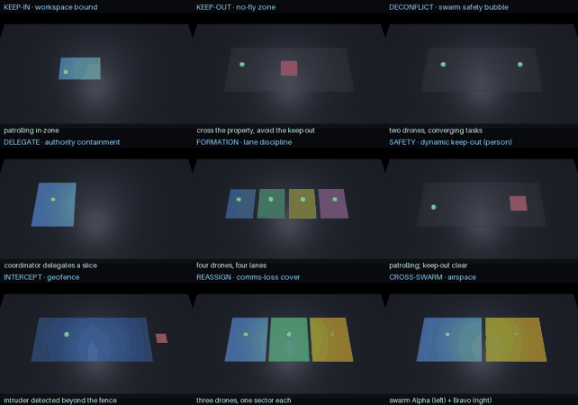

# Runtime-assurance gallery — nine kinds of refusal, one library



```
pip install mujoco imageio pillow
MUJOCO_GL=egl python make_gallery.py
```

Nine short MuJoCo scenarios, each showing openDaisugi **refusing a different kind of
unsafe action** — and every refusal is a *real* `verify()` / swarm check, not a
scripted animation. `make_gallery.py` **proves that first**: it independently re-runs
each scenario's core check and asserts it accepts the safe case and rejects the unsafe
one, before rendering a single frame. It writes each clip to `docs/assets/gallery/` and
tiles them into the grid above.

Color code: **green** accepted · **amber** out-of-bounds refused, pulled back · **red**
hard hold/refusal.

| # | Scenario | What it refuses | The check |
|---|---|---|---|
| 1 | **Keep-in workspace** | reaching outside the assigned volume | `workspace_bounds` |
| 2 | **No-fly / keep-out** | a *path* clipping a keep-out zone (trajectory-sampled) | `obstacles` |
| 3 | **Deconfliction** | two drones closing inside the safety bubble | `aabb_disjoint` |
| 4 | **Delegation** | tasking a drone beyond its granted authority | `envelope_subsumes` |
| 5 | **Formation** | a drone drifting out of its lane | per-lane `workspace_bounds` |
| 6 | **Dynamic keep-out** | entering a *moving* person's exclusion zone | moving `obstacles` |
| 7 | **Geofence / intercept** | chasing an intruder off-property | `workspace_bounds` |
| 8 | **Comms-loss reassignment** | a reassignment that overlaps a survivor | `verify_swarm_tasking` |
| 9 | **Cross-swarm** | one swarm entering another's airspace | `aabb_disjoint` |

Same lesson every tile: the policy is a black box; openDaisugi bounds what it's
*allowed* to do, and refuses the rest — proven before motion.

## Honest scope

Analytic geometry, plan/volume level (see [yellow paper §7](../../docs/spec/yellow-paper.md)):
waypoint-in-box ≠ path-in-box, and disjoint boxes are collision-free only with margin
≥ vehicle radius + position uncertainty. These prove *tasking/plan* safety, not flight.
The scenes are kinematic illustrations; the `verify` calls in them are real.
