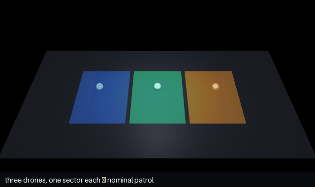

# Swarm communication & delegation — verified authority transfer



*Delegation, visualized: `drone_mid` loses comms; the coordinator expands `west`'s
authority to cover the gap — **accepted** only after `verify_swarm_tasking` re-proves
it's still contained AND deconflicted; the "hand it to both neighbors" alternative
flashes the overlap **red — rejected before any drone moves**.*

```
python run_demo.py                       # the four scenarios, text output (CPU, zero deps)

pip install mujoco imageio pillow
MUJOCO_GL=egl python mujoco_render.py     # regenerate the GIF above (headless CPU render)
```

No physics, no GPU, no network, no model needed for the gate — pure envelope algebra,
runs anywhere. (The GIF is a kinematic illustration; the verify calls in it are real.)

## The idea

In openDaisugi, **a message that carries authority IS a delegation.** "Drone, patrol
sector 3" is a *tasking envelope*. So safe swarm communication reduces to one
machine-checkable question, asked *before anyone acts*:

> **Is the transferred authority contained within the recipient's own authority?**
> `envelope_subsumes(recipient, task)` for delegation; disjointness for deconfliction.

Coordination becomes an exchange of tasking envelopes, each re-proved on receipt,
fail-closed. No trust in the sender required — the receiver proves containment.

## The four scenarios (each leads with the rejection)

| # | Scenario | Communication pattern | The refusal |
|---|---|---|---|
| 1 | **Delegation hierarchy** | mission → squads → drones (nested `envelope_subsumes`) | a squad tasks a drone **beyond its own grant** → rejected |
| 2 | **Lateral hand-off** | drone A hands a tracking task to drone B | A hands B a task **B isn't authorized for** → rejected |
| 3 | **Comms-loss reassignment** | a survivor expands to cover a downed peer | a reassignment that **overlaps a survivor** → rejected *before any drone moves* |
| 4 | **Cross-swarm coordination** | two swarms publish volumes, verify disjoint | a swarm entering airspace that **overlaps another** → rejected |

The primitives: `envelope_subsumes` (containment / delegation — vertical *and*
lateral), `verify_swarm_tasking` (subsumption **and** pairwise disjointness),
`aabb_disjoint` / `aabb_intersection` (deconfliction geometry).

## Related

- [swarm-tasking](../swarm-tasking/) — the static deconfliction certificate.
- [property-patrol](../property-patrol/) — the Simplex loop *in motion* (a mock VLA
  proposing actions, gated live).
- A physics + real-VLA upgrade (MuJoCo on CPU / Colab, SmolVLA/π0) is documented in
  those READMEs; the verification wiring here does not change.

## Honest scope

Analytic geometry, plan/volume level (see [yellow paper §7](../../docs/spec/yellow-paper.md)):
this proves *tasking* is safe — that no agent is handed authority it wasn't granted
and no two are handed overlapping space — not that flight is collision-free.
Waypoint-in-box ≠ path-in-box; set margins ≥ vehicle radius + position uncertainty.
